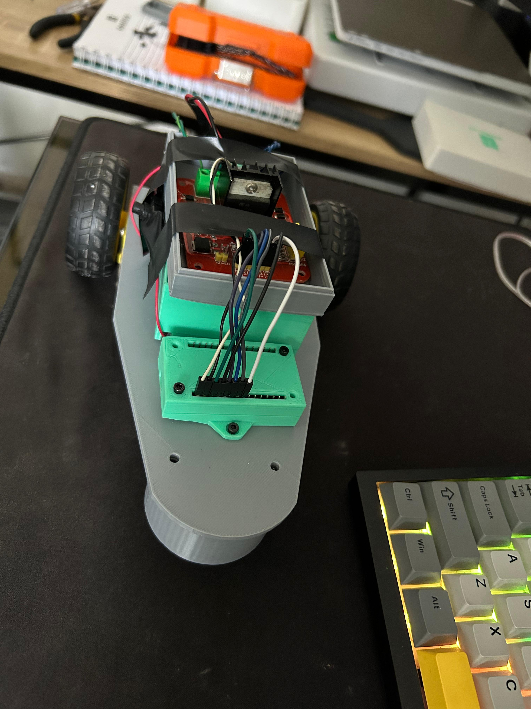
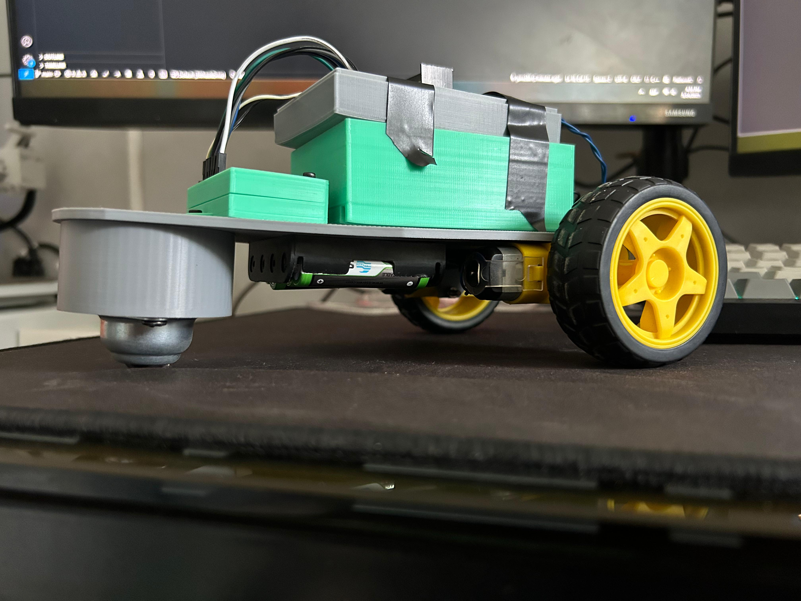

# Robot 2WD Controlado por PS4 con ESP32

## 📋 Descripción

Este proyecto consiste en un robot móvil de dos ruedas (2WD) controlado de forma inalámbrica usando un control de PS4 y un ESP32. El robot permite movimiento hacia adelante, atrás y giros suaves usando los joysticks. Es una excelente introducción a la robótica móvil y al control remoto con microcontroladores.

---

## 🧠 Características principales

* Control por Bluetooth mediante un control de PS4
* Aceleración y dirección con los joysticks
* Giros suaves al avanzar
* Giro sobre su eje al estar detenido
* Compatible con ESP32 y puente H L298N
* Código totalmente comentado

---

## 🛠️ Componentes utilizados

| Componente          | Cantidad |
| ------------------- | -------- |
| ESP32 (DevKit)      | 1        |
| Módulo L298N        | 1        |
| Motor DC con ruedas | 2        |
| Batería/powerbank   | 1        |
| Chasis impreso 3D   | 1        |
| Control de PS4      | 1        |
| Cables y protoboard | -        |

---

## ⚙️ Conexiones

| ESP32   | L298N | Descripción               |
| ------- | ----- | ------------------------- |
| GPIO 14 | IN1   | Dirección motor derecho   |
| GPIO 27 | IN2   | Dirección motor derecho   |
| GPIO 26 | IN3   | Dirección motor izquierdo |
| GPIO 25 | IN4   | Dirección motor izquierdo |
| GPIO 13 | ENA   | PWM motor izquierdo       |
| GPIO 12 | ENB   | PWM motor derecho         |

> Alimentación: ESP32 por USB (PowerBank) y L298N desde batería externa (5V - 6V)

---

## 💾 Código fuente

El código completo está en `main.cpp`. Algunas funciones clave:

* `ledcWrite` para controlar velocidad vía PWM
* Uso de la librería `PS4Controller.h` para lectura de joysticks
* Lógica de mezcla diferencial para combinar velocidad + giro

---

## 🎮 Controles

| Control PS4            | Función                   |
| ---------------------- | ------------------------- |
| Joystick izquierdo (Y) | Acelerar / Retroceder     |
| Joystick derecho (X)   | Girar izquierda / derecha |

---

## 🧪 Pruebas y comportamiento

* En reposo, el robot puede girar como un tanque (en su lugar)
* Al avanzar, el giro se suaviza proporcionalmente a la velocidad
* Sensible y estable a diferentes niveles de aceleración

---

## 📷 Imágenes / Videos

---

## 💡 Próximas mejoras

* Mejorar el chasis
* Utilizar una sola fuente de energia y evitar el uso de powerbank + Baterias
* Mejoras en codigo para casos donde se pierde la conexion con el control

---

## 📃 Créditos

Este proyecto fue desarrollado por Jaime Torres con asistencia técnica de ChatGPT, ademas de la libreria PS4Controller.h

## 🧩 Librerías utilizadas

- [PS4_Controller_Host](https://github.com/pablomarquez76/PS4_Controller_Host) de [@pablomarquez76](https://github.com/pablomarquez76): Librería para conexión Bluetooth del ESP32 con controles de PS4.

